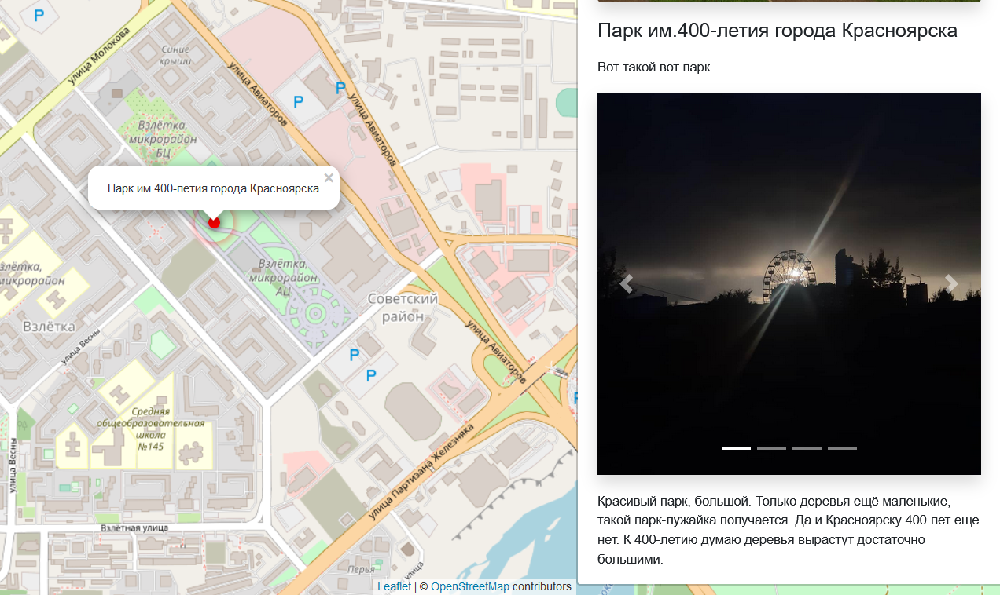
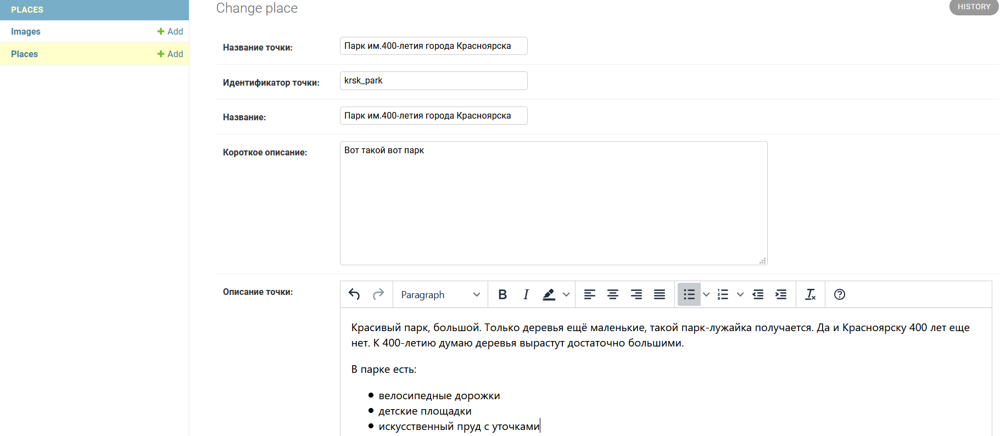
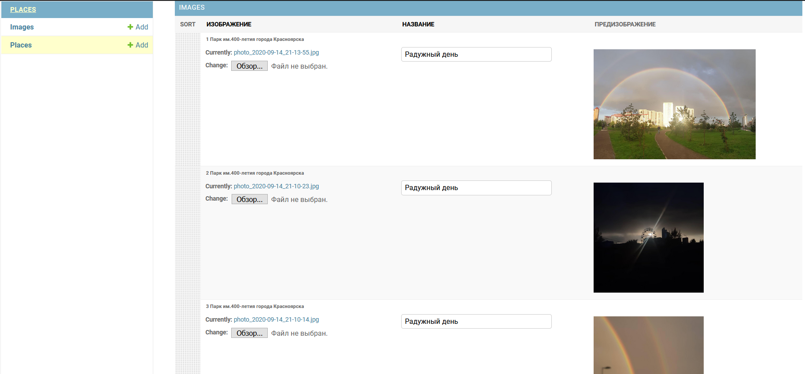

# Куда пойти — Москва глазами Артёма
Devman. Django. Первый урок.

Сайт реализован в рамках курса по Django на [devman.org](devman.org).

Сайт можно посмотреть по ссылке [тут](http://rayotto.pythonanywhere.com/).

## Фронт проекта
Проект представляет из себя карту мира. На которую можно наносить достопримечательности.

При нажатии на точку можно увидеть описание и фотографии.

Фронт взят [отсюда](https://github.com/devmanorg/where-to-go-frontend)

 

## Кастом админка
Процесс добавления места реализован через кастомизированную админку.

Для поля описания точки подключен редактор текста.

Попробовать [админку](http://rayotto.pythonanywhere.com/admin/) можно по доступу guest TgB7Dx5DRYrEh5P 

Изображения можно добавлять прямо на странице редактирования точки.

Порядок изображений можно менять drag-and-drop.

Первое изображение будет в шапке точки, остальные в карусели.

 

## Используемые библиотеки

* [WYSIWYG-редактор](https://github.com/aljosa/django-tinymce) - редактор текста

* [django-admin-sortable2](https://pypi.org/project/django-admin-sortable2/) - чтобы менять порядок изображений точки с помощью drag-and-drop

* [pythonanywhere](pythonanywhere.com) - хостинг проекта

## Данные

Тестовые данные взяты с сайта [KudaGo](https://kudago.com).
